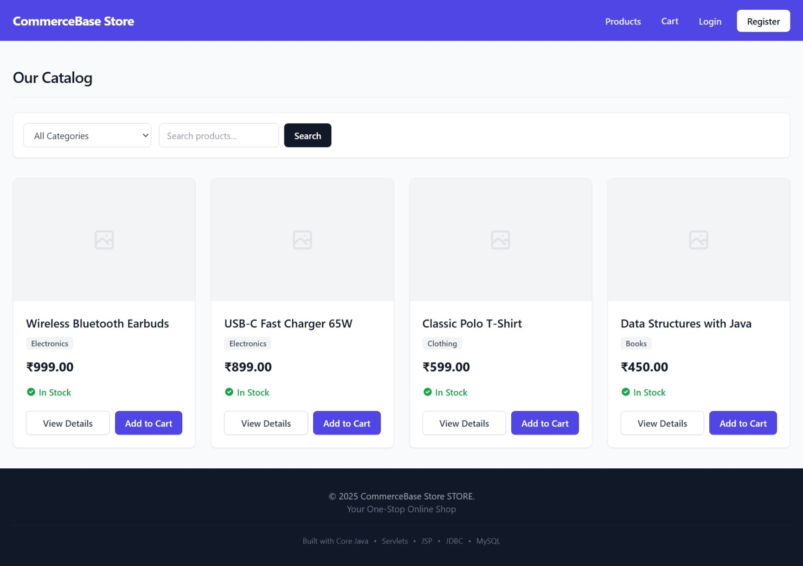
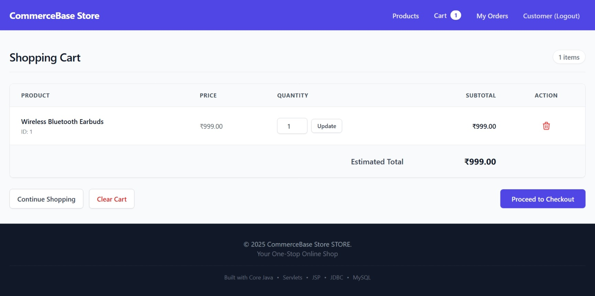
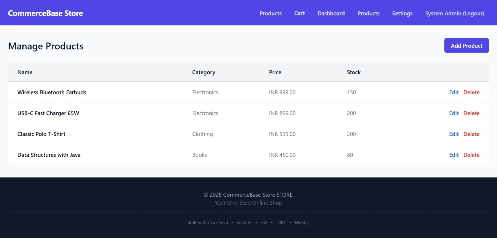
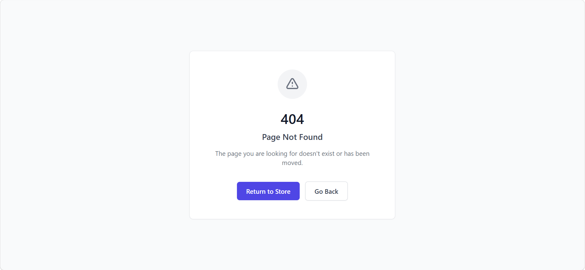

# CommerceBase 🛒 (Production-Ready Java MVC E-Commerce Platform)

CommerceBase is an enterprise-pattern e-commerce web platform built as a BCA Final Year Major Project (2025). Designed to demonstrate full-stack fundamentals without modern abstraction layers, it uses pure Java Servlets, JSP with JSTL, and raw JDBC to deliver a scalable, role-secured online store.

The project features a decoupled Model-View-Controller (MVC) architecture, an administrative management suite, dynamic database-driven branding, and strict security hardening against standard web vulnerabilities.

---

## 📸 System Architecture & Previews

### 1. Dynamic Product Catalog & Search
Dynamic multi-category filtering, live search queries, and responsive card layouts rendered server-side via custom JSP tags.


### 2. Session-Driven Cart & Checkout Pipeline
Session-scoped cart state management with real-time subtotal computation, quantity modification, and Cash on Delivery (COD) processing.


### 3. Role-Protected Administrative Console
Restricted portal enabling inventory tracking, product lifecycle management (Create, Read, Update, Delete), and live store configuration.


### 4. Stack Trace Masking & Error Containment
Custom HTTP error interceptors mapped through `web.xml` to prevent Apache Tomcat internal diagnostic leaks.


---

## 🛡️ Security Hardening & Defenses

* **Zero Scriptlet Enforcement:** JSPs are strictly declarative presentation files; raw Java scriptlets (`<% ... %>`) are prohibited. All dynamic database outputs are sanitized via JSTL `<c:out value="..." />` to neutralize Cross-Site Scripting (XSS).
* **Parameterized Persistence:** Data access layers completely avoid raw string concatenation. All database operations strictly use `PreparedStatement` with bind parameters (`?`) to prevent SQL Injection (SQLi).
* **Role-Based Access Control (RBAC):** Incoming requests to `/admin/*` routes are intercepted by a servlet `AuthFilter` that validates session tokens and user authorization flags before forwarding execution.
* **Cryptographic Password Storage:** User credentials undergo salted SHA-256 hashing prior to database storage, ensuring plain-text passwords never touch persistence disks.
* **Server Information Masking:** Customized `web.xml` mappings route 404, 500, and uncaught `java.lang.Throwable` exceptions to a hardened `error.jsp`, preventing Apache Tomcat version and stack trace disclosure.

---

## 🛠️ Technology Stack

| Layer | Component | Specification |
| :--- | :--- | :--- |
| **Runtime / Core** | Java Development Kit (JDK) | OpenJDK 11+ |
| **Web Container** | Apache Tomcat | 7.0 Embedded (Maven Plugin) |
| **Architecture** | Architectural Pattern | Strict Model-View-Controller (MVC) |
| **Backend** | Java EE | Servlets (`HttpServlet`), Filters, JSTL Core |
| **Database** | Relational Database | MySQL 8.0 via raw JDBC Connection Pooling |
| **Build Tool** | Project & Dependency Management | Apache Maven 3.8+ |
| **Frontend** | Styling Framework | Tailwind CSS (CDN-delivered utility styling) |

---

## 📂 Architectural Structure

```text
CommerceBase/
├── database/
│   └── schema.sql                  # Relational tables, indexes, and seed records
├── docs/                           # Architecture specs, security rules, and PRD
├── src/
│   └── main/
│       ├── java/com/commercebase/
│       │   ├── controller/         # HTTP request routing & dispatching servlets
│       │   ├── dao/                # Parameterized JDBC persistence interfaces
│       │   ├── filter/             # RBAC authentication & theme injection filters
│       │   ├── model/              # Pure Java POJO entity data models
│       │   └── util/               # Connection pooling & cryptographic hashing
│       └── webapp/
│           ├── assets/             # Client-side style and script definitions
│           ├── error.jsp           # Hardened generic exception page
│           └── WEB-INF/
│               ├── views/          # Restricted customer and admin JSP templates
│               └── web.xml         # Servlet routing, filters, and error handlers
└── pom.xml                         # Build lifecycle and plugin configurations
```

---

## ⚙️ Setup & Local Deployment

### Prerequisites
* JDK 11 or higher installed and added to `PATH`
* MySQL 8.0 Server running locally
* Apache Maven installed

### 1. Database Provisioning
Log in to your local MySQL CLI or GUI client and run the database initialization script:
```sql
SOURCE database/schema.sql;
```

### 2. Configure Database Credentials
Verify or update your database connection parameters in `src/main/java/com/commercebase/util/DBConnection.java`:
```java
private static final String URL = "jdbc:mysql://localhost:3306/commercebase_db";
private static final String USER = "root";
private static final String PASS = "your_password";
```

### 3. Build and Launch
Execute the embedded web container through Maven:
```powershell
mvn clean tomcat7:run
```

Once initialized, navigate to:
```text
http://localhost:8080/commercebase
```

### 4. Pre-Configured Test Credentials
* **Customer Account:** `customer@example.in` | Password: `Customer@123`
* **Administrator Portal:** `admin@commercebase.local` | Password: `Admin@123`

---

## 👨‍💻 Author
**Saurav Pandey**
* GitHub: [@5auravpandey](https://github.com/5auravpandey)
* LinkedIn: [linkedin.com/in/5auravpandey](https://www.linkedin.com/in/5auravpandey)
* Program: Bachelor of Computer Applications (BCA, 2025)
